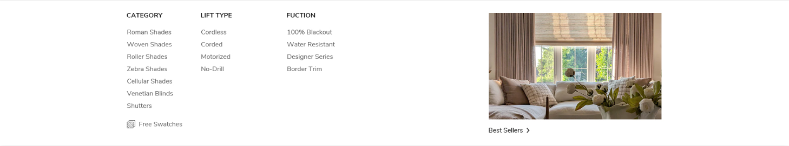

# Drapery Design

后续在此记录 `Drapery` 菜单下拉重构的设计说明、结构要求、交互要求和素材说明。

参照设计截图：

- 上方的加粗黑体为二级菜单，每个二级菜单下方对应这个自己的三级菜单，最下方有一个图片（暂时先占位）加一个文本
- 右边是一张图片，图片来源做成可配置项，例如 section.blocks, 需要关联上 Drapery 这个一级菜单
- 图片下方是一个文本加一个箭头，是一个可点击的链接，点击后会跳转到对应的三级菜单，链接来源和图片一样，做成可配置项，同样需要关联上 Drapery 这个一级菜单

**注意**

基本功能：所有二级菜单和三级菜单。 无特殊的交互

## 需求梳理结论

### 1. 布局结构

`Drapery` 下拉菜单采用桌面端左右两栏结构：

- 左侧：菜单内容区
- 右侧：图片推广区

### 2. 左侧菜单内容区

左侧主内容继续使用 Shopify 后台菜单树数据：

- 一级菜单：`Drapery`
- 二级菜单：`Drapery` 下的 `link.links`
- 三级菜单：各个二级菜单下的 `child_link.links`

渲染要求：

- 每个二级菜单作为一个独立栏目
- 二级菜单标题为加粗黑体
- 每个二级菜单标题下方展示该栏目对应的三级菜单链接
- 保持当前 hover 打开 dropdown 的交互方式

### 3. 左侧底部附加内容

左侧菜单内容区底部增加一块附加内容：

- 一个图片或图标
- 一个文本
- 可点击跳转

这块内容不来自 Shopify 菜单树，建议通过 Header section 的独立 block 配置。

### 4. 右侧图片推广区

右侧区域包含：

- 一张图片
- 图片下方一条文本链接
- 文本链接后带箭头图标

这部分也不来自 Shopify 菜单树，建议通过 Header section 的独立 block 配置，并绑定到 `Drapery`。

### 5. 建议新增的配置内容

为了实现该设计，`Drapery` 需要至少一组独立配置，建议字段包括：

- `right_image`
- `right_link_text`
- `right_link_url`
- `bottom_image`
- `bottom_text`
- `bottom_link_url`

该 block 为 `Drapery` 专用 block，不再需要通过 `Link name` 做一级菜单匹配。

### 6. 当前阶段结论

`Drapery` 的需求已经足够进入代码编写阶段。

下一步开发重点：

- 编写 `nav-dropdown-drapery.liquid`
- 为 `Drapery` 增加专用 block 配置
- 将当前 placeholder 替换为专用桌面端布局
